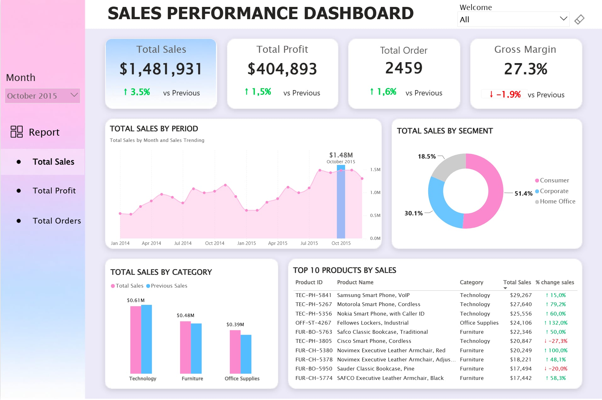
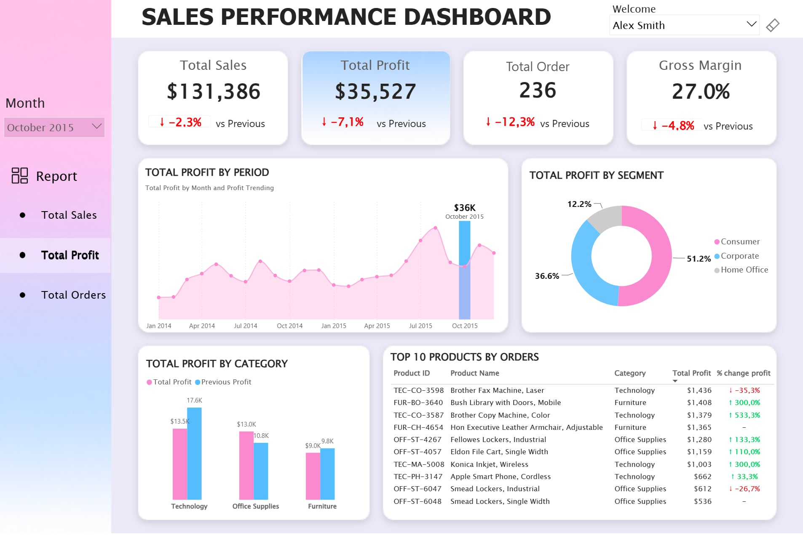
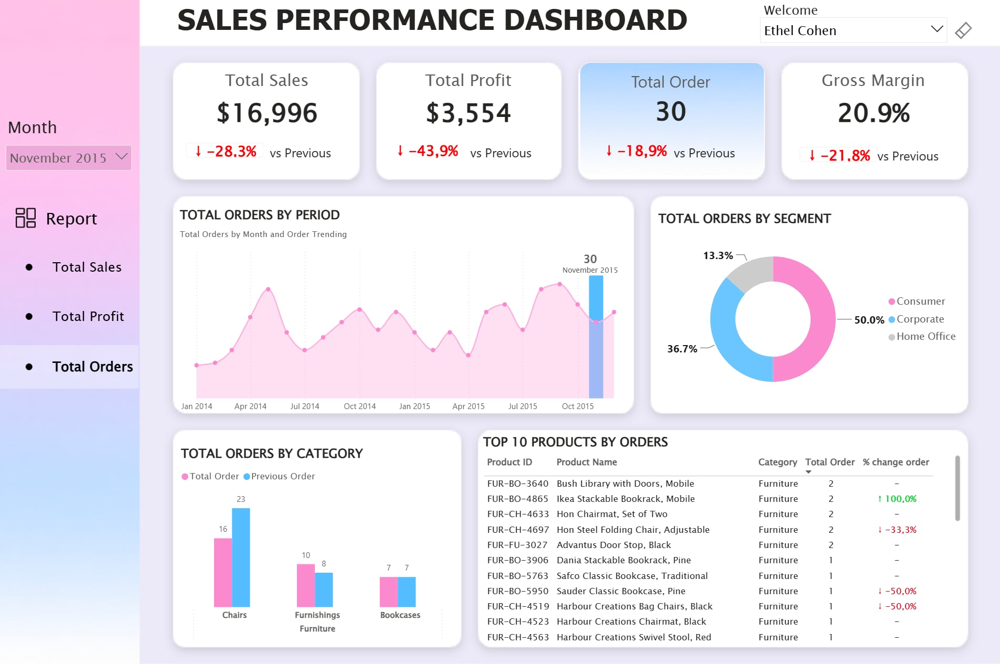

# 📊 Sales Performance Dashboard

An interactive **Power BI dashboard** designed to analyze and compare sales performance across employees.

Users can select an individual employee or view **all employees** to explore performance across three key perspectives: **Sales, Profit, and Orders**.

---

## 📌 Dashboard Preview

### Sales View


### Profit View


### Orders View


---

## 🎯 Project Objective

The goal of this project is to provide a clear and interactive view of **employee sales performance**.

The dashboard allows users to:

- View performance for **all employees or a selected employee**
- Track **Sales, Profit, and Orders**
- Compare current performance with the **previous period**
- Analyze performance trends over time
- Identify top performing products
- Explore performance across countries and customers

---

## 📈 Dashboard Features

- **Employee filter** for individual or overall performance analysis
- Three analytical views: **Sales, Profit, and Orders**
- Dynamic KPI cards with previous period comparison
- Monthly performance trends
- Product level performance analysis
- Customer level performance analysis
- Interactive filters for further exploration

---

## 🛠️ Tools & Skills

- **Power BI**
- **DAX**
- **Data Visualization**
- **Business Intelligence**

---

## 📁 Repository Structure

```text
sales_performance_dashboard/
│
├── data/
│   └── orders.xlsx
│
├── images/
│   ├── sales_view.jpeg
│   ├── profit_view.jpeg
│   └── orders_view.jpeg
│
├── powerbi_dashboard/
│   └── sales_performance.pbix
│
└── README.md
```

---

## 📂 Files

**Power BI Dashboard**

`powerbi_dashboard/sales_performance.pbix`

**Source Dataset**

`data/orders.xlsx`

---

## 👤 About

This project is part of my data analytics portfolio and demonstrates practical skills in **Power BI, DAX, data modeling, KPI design, and interactive employee performance analysis**.
